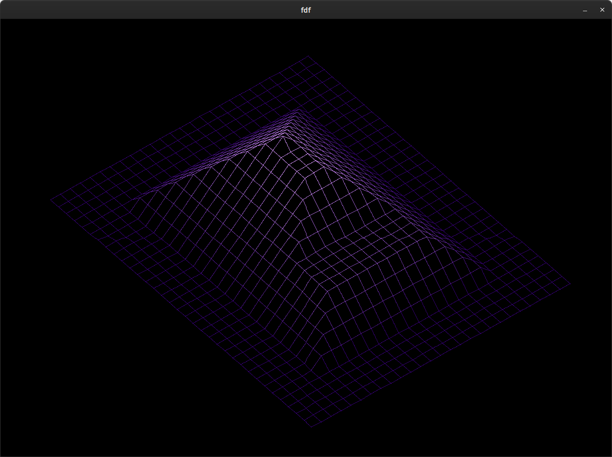
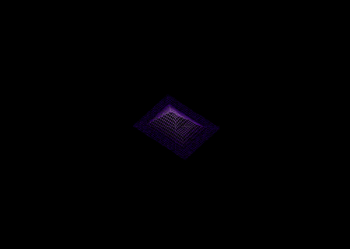

<table>
  <tr >
    <td></td>
    <td></td>
  </tr>
</table>


## 3d Wireframe Model README

[](https://github.com/42Paris/minilibx-linux/actions/workflows/ci.yml)

This is the MinilibX, a simple X-Window (X11R6) programming API
in C, created as a part of the 42 curriculum, suitable for X-beginners.

#### Requirements for Linux

 - MinilibX only support TrueColor visual type (8,15,16,24 or 32 bits depth)
 - gcc
 - make
 - X11 include files (package xorg)
 - XShm extension must be present (package libxext-dev)
 - Utility functions from BSD systems - development files (package libbsd-dev)
 - **e.g. _sudo apt-get install gcc make xorg libxext-dev libbsd-dev_ (Debian/Ubuntu)**
 
#### Requirements for MacOS
 - [Xquartz](https://www.xquartz.org/)

```bash
➜  ~ Brew install Xquartz
➜  ~ reboot
➜  ~ xeyes # run an hello world X11 app
```

MlX Color Opacity / Transparency / Alpha (32 bits depth)
 - 0xFF (fully transparent) or 0x00 (fully opaque)

#### Compile MinilibX

 - make


#### Install MinilibX

 - no installation script is provided. You may want to install
     - libmlx.a and/or libmlx_$(HOSTTYPE).a in /usr/X11/lib or /usr/local/lib
     - mlx.h in /usr/X11/include or /usr/local/include
     - man/man3/mlx*.1 in /usr/X11/man/man3 or /usr/local/man/man3

